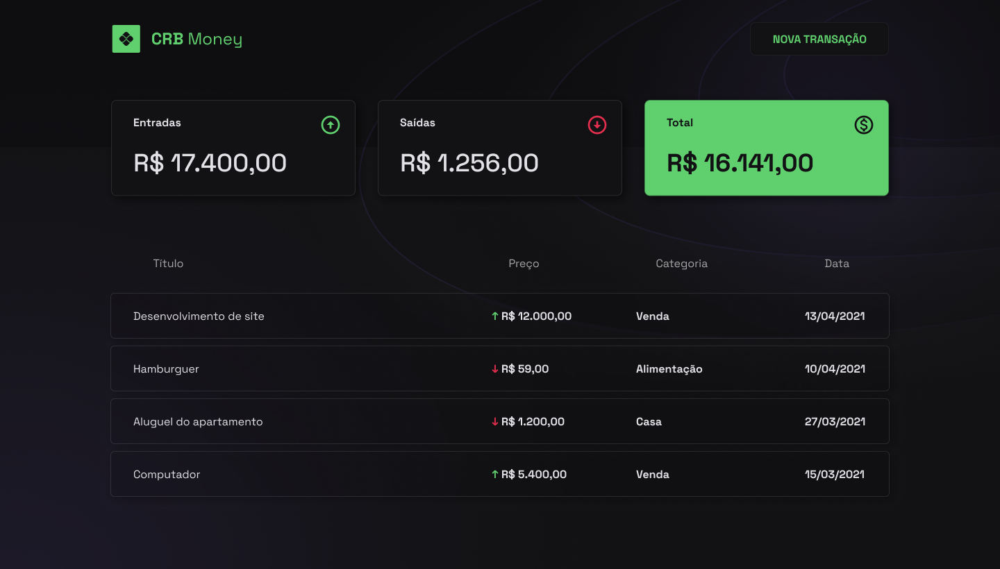

<h1 align="center"> CRB Money </h1>

A simple personal finance app designed and deveploped by me.

  <a href="#-tecnologias">Technologies</a>&nbsp;&nbsp;&nbsp;|&nbsp;&nbsp;&nbsp;
  <a href="#-projeto">Project</a>&nbsp;&nbsp;&nbsp;|&nbsp;&nbsp;&nbsp;
  <a href="#-layout">Layout</a>&nbsp;&nbsp;&nbsp;|&nbsp;&nbsp;&nbsp;

 

  

## ✸ Technologies

This projetc was developed with these technologies:

- [Figma](https://www.figma.com/file/25g25nubTWuoPCoIfTVpkr/CRB-Money)
- HTML e CSS
- Typescript e JSON
- [Node and Yarn](https://nodejs.org/)
- [Create React App](https://create-react-app.dev)
- [Styled Components](https://styled-components.com)

## ⬢ Project

CRB Money is a simple application tha simulates our financial sratement with simple math. It's possible to add inputs trhoug a modal and update HTML elements.

## ❖ Layout

Take a look at the project's Layout designed on [Figma](https://www.figma.com/file/25g25nubTWuoPCoIfTVpkr/CRB-Money).

It`s necessary a [Figma](https://figma.com) account to access it.

@creisbarbosa
